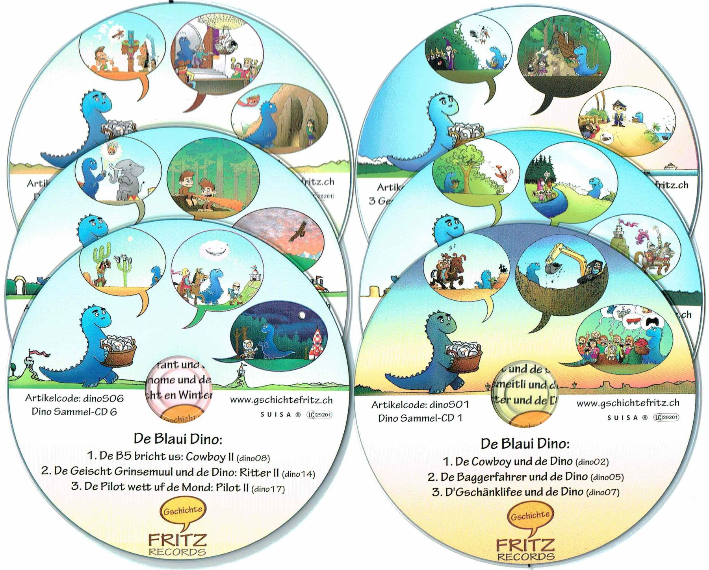

I created over 70 unique Swiss-German audio stories with songs for children. I wrote and narrated each story, sang the songs, and produced everything in my own studio. My distribution method was one of a kind: each story was prepared on-demand, complete with a personal dedication in the introduction. For example, "This story is for Anna, a gift from Uncle Fred." The stories were available on CD and/or as MP3 downloads, with payment on a voluntary, pay-what-you-want basis. This system was supported by sophisticated software, which I developed and continuously enhanced over 15 years with new features.

However, as CDs became less popular over time and I wanted to streamline my involvement, I made a pivotal change in 2023. I decided to end the physical distribution and personal dedications. Instead, I rebuilt the software from the ground up on a new technology stack, focusing on core features. Therefore, I now distinguish between two projects: 'gschichtefritz.ch legacy' and 'gschichtefritz.ch current'.

