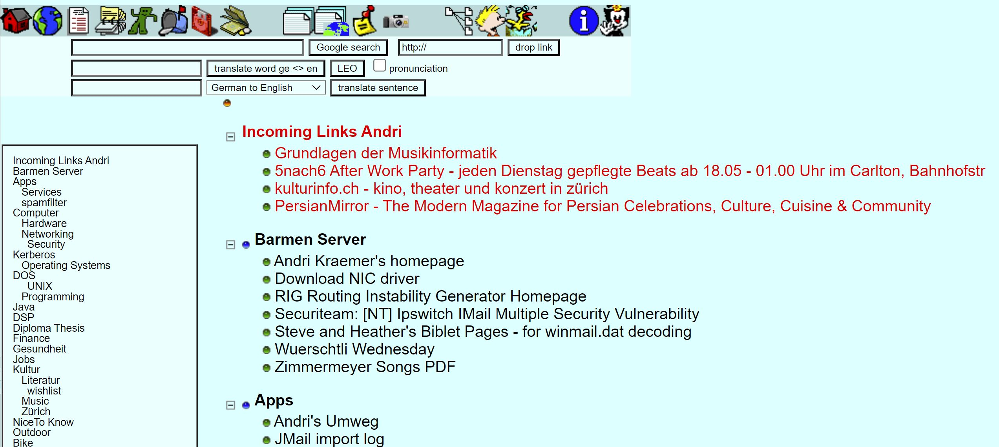

The World Wide Web was still in its infancy. There was no Google, no PHP, no WordPress, and no Facebook. But there was PublicSecrets—a blend of social networking and productivity platform. I began developing PublicSecrets in 1997 and continued to expand it over the years. It was used by all of my friends and even friends of friends

### Features

OpenAlbum
: Put your photos online. Select from different style templates. Decide whether the album should be public, restricted to PublicSecrets users, restricted to your friends, to a list of friends or private ('secret'). Create slideshows. Get user comments. Add 'order picture' button (for print orders) and even use an album as gift list for weddings or birthdays (add 'I give this to you as a present' button that disappears when somebody has already clicked it). OpenAlbum provides detailed access statistics. 

: Years later, similar services such as Picasa (acquired by Google in 2004) were launched.

Address Book
: Add entries and decide which of your friends you want to share each entry with. Duplicates are actively avoided: If you add an address that a friend has already added, you'll gain access to the existing record instead of creating a duplicate. All friends have read and write access to shared records, ensuring that the data remains well-maintained and up-to-date. You’ll never forget a friend's birthday, as PublicSecrets sends you email reminders and displays a list of upcoming birthdays after you log in. Addresses can also be grouped into address lists.

Bookmarks
: Individual bookmarks / links can be shared and grouped hierarchically. The bookmark check tool reports invalid/outdated bookmarks.

Notes
: Manage your personal notes.

PSMail
: PublicSecrets Mail is a webmail client allowing you to create new mail accounts or registering existing (third-party) e-mail accounts. It provides full text search capabilities, shared e-mail accounts, aliases, mailing list management, virus scanning, spam filtering and folders. 

:  PSMail was available long before Gmail or Yahoo Mail.

PSFile
: Files can be shared with other PublicSecrets users. All uploads are scanned for viruses. Files can be encrypted using individual passphrases. PSFiles can also be attached to PSMail messages.

: The PSFile cloud file store was already available when the word 'cloud' had no other meaning and there was no Google Drive, Dropbox or Microsoft OneDrive.

PSEvent
: For the legendary Würstli Wednesday events, I built a somewhat sophisticated event management system into PublicSecrets. It works like this: You can define a new event in PS, including a description, date, time, etc. Afterwards, you add items (e.g., beer, potato chips, potato salad) to the event and determine how many participants are needed per item (e.g., potato chips for every 3 participants, potato salad for every 10 participants, etc.).
Using the PS address book, you can invite guests and send them an invitation via PSMail. On the event homepage, guests can sign up or opt-out. For events with gadgets, each guest can see which gadgets are currently needed and select which one(s) they would like to bring themselves. All guests can see who has signed up or opted out and who is bringing what. The ultimate tool for "self-organizing parties".

PSAccounting
: Create a cash book, assign people from your address book as members and start your shared accounting. Each entry has a date, an amount, a member involved as creditor and one or more involved as debtors. At each moment, any member can see the current total of expenses and debts and how much who would have to pay to whom in order to re-balance the account (pay off all debts with the smallest number of transactions).
: This was exactly what later became popular with apps like Splittr - but years before the iPhone was invented.

PSDocs
: Upload any zipped documentation. It gets unzipped and indexed by the built-in full-text search engine.
: The best thing, software develpers could dream of at that time to quickly browse JavaDocs etc.

PS GarbageAlert
: Reminds you of the waste paper or cardboard collection dates for the district you live in. Only for Zurich.

: Years later, ERZ (Entsorgung + Recycling Zürich) came up with a similar service.

PSVote
: Ideas for extensions are proposed here and all users can vote on them.

PublicSecrets was written in ColdFusion and ran on a Windows NT server.
